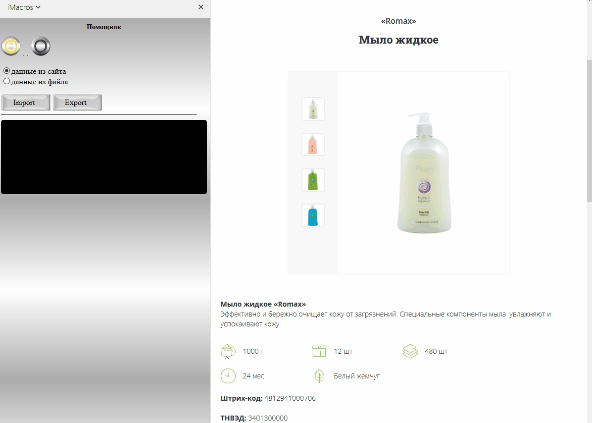
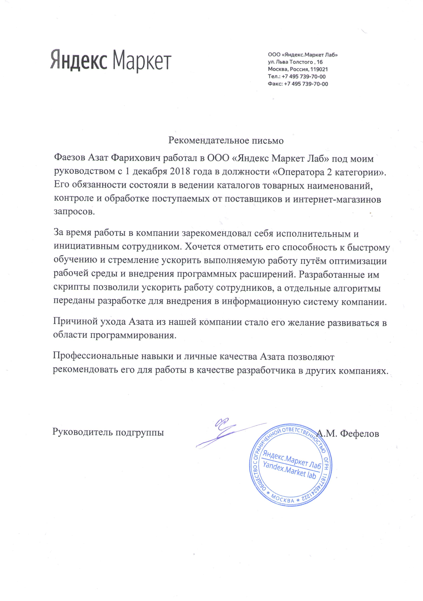

# Навигация:
1. [Обо мне...](#Путь-разработчика)
2. [Первые шаги](#Первый-проект)
3. [Рекомендация **для hh**](#recommendation)
4. [Реализцаия игры 'Квадраты'](#squares)

# Путь разработчика

Всем привет! Мне 29 лет и я решил продолжить свой путь в направлении прогрммиста. До сегоднешнего дня работал, да и продолжаю работать, занимаясь набором контента для известной всем торговой площадки. Работа не особо интересная, часто рутинная, однако поддаётся автоматизации и долгое время была хорошим источником дохода и стимулом для изучения языков программирования. Так я познакомился с JavaScript...

## Первый проект

Для изучения нового материала нужна практика, без неё - никуда. Для меня же первым значимым проектом стала серия скриптов работавшая на основе расширения iMacros для Mozilla. iMacros в связке с JavaScript позволили не только парсить и обрабатывать любую информацию с открыой страницы браузера, но эмулировать действия пользователя в качестве ответа (клики, загрузка и сохранение файлов, управление вкладками в окне бразуера), сохранять отчеты в файл, запускать простейшие исполнительные файлы на ПК и бонусом - возможность верстки графического UI в пределах окна расширения.

<место для описания проекта>

На базе этого проекта затем были созданы ряд менее значительных, как, например, подобный парсер параметров товара:

Если вдруг, кого-то заинтересует iMacros, то советую почитать [тут](https://nagibaka.ru/js-imacros-lessons-for-beginners/).
Очень даже вероятно, что взглянув на проект, читатель сравнит его с детской игрушкой, но для меня это "Hello, чтоб его... JavaScript". И как говорил один из киногероев: "По-моему, сам опыт - это уже опыт".

Благодарю своих руководителей за положительную оценку моих трудов. Для получения контактов прошу писать в личку.

Recommendation

	

## Что дальше?

Следующая цель - изучить Node JS, понять, как он работает. В качестве проекта решил реализовать игру ["Квадраты"](https://github.com/farscince/myProjects/tree/master/squares)
